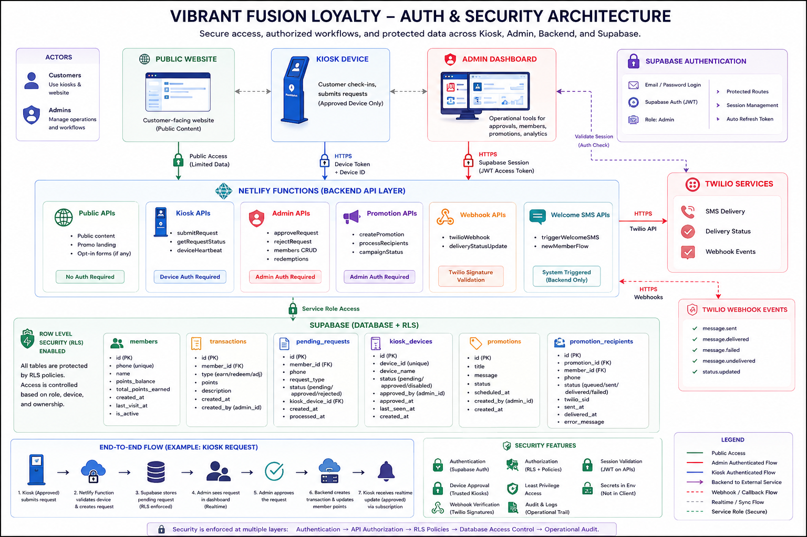
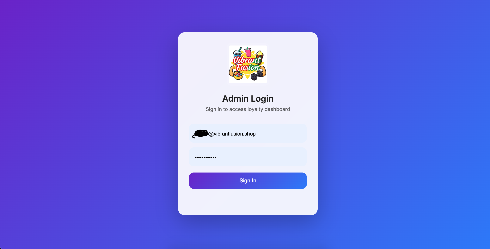
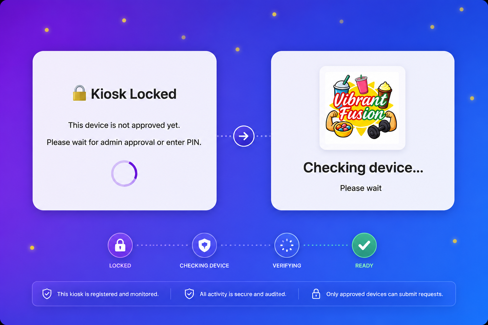

## Overview

The Vibrant Fusion platform was designed with layered security boundaries across the customer website, kiosk workflows, admin dashboard, serverless backend functions, and Supabase database layer.

The security architecture focused on protecting privileged operational workflows such as:

- admin dashboard access
- loyalty point mutations
- redemption processing
- promotions management
- kiosk device approval
- transactional database updates

The platform intentionally separates public customer interactions from authenticated administrative actions and backend-controlled transactional workflows.

---

## Security Architecture Goals

The security model was designed around several core goals:

- protect admin-only workflows
- prevent unauthorized loyalty mutations
- isolate sensitive credentials from frontend code
- enforce database-level access controls
- validate backend API requests
- restrict kiosk access to approved devices
- support realtime kiosk updates safely
- preserve operational auditability

The system follows a layered trust model where frontend clients can initiate workflows, but privileged state changes are processed through authenticated backend paths.

---

## High-Level Security Model

```text
Public Website
      │
      ▼
Customer-Facing Frontend
      │
      ▼
Limited Public Interactions
      │
      ▼
Backend Validation Layer
      │
      ▼
Supabase RLS + Database Policies


Kiosk Device
      │
      ▼
Device Registration / Approval
      │
      ▼
Approved Device Workflows
      │
      ▼
Pending Requests + Realtime Updates


Admin Dashboard
      │
      ▼
Supabase Authentication
      │
      ▼
Session Token
      │
      ▼
Authenticated Netlify Functions
      │
      ▼
Privileged Backend Operations
      │
      ▼
Database Transactions
```

---
## Security Architecture Diagram


---
## Supabase Authentication

Supabase Authentication protects the admin dashboard and privileged operational workflows.

The admin interface requires a valid authenticated session before allowing access to:

- admin dashboard views
- pending request approvals
- member management
- redemption workflows
- promotions management
- transactional operations

This ensured that sensitive operational tooling was not publicly accessible.

---

## Admin Page Protection

The admin page is protected using Supabase Auth session validation.

The frontend checks whether an authenticated admin session exists before rendering protected admin functionality.

If no valid session exists, the user is redirected away from the admin dashboard or shown a login flow.

Protected admin workflows include:

- viewing pending kiosk requests
- approving or rejecting requests
- modifying loyalty balances
- processing redemptions
- viewing member activity
- creating promotions
- processing SMS campaigns

This client-side protection improves user experience, while backend validation provides the actual security boundary.

---

## Netlify Function Authentication

All privileged Netlify Functions are authenticated using the Supabase session token.

The admin frontend sends the active session access token with requests to protected backend functions.

Backend functions validate the token before executing privileged logic.

Typical flow:

```text
Admin Logs In
      │
      ▼
Supabase Session Created
      │
      ▼
Access Token Stored Client-Side by Supabase
      │
      ▼
Admin Calls Netlify Function
      │
      ▼
Authorization Header Includes Bearer Token
      │
      ▼
Netlify Function Validates Session
      │
      ▼
Privileged Operation Executes
```

This prevents unauthenticated clients from calling sensitive backend workflows directly.

---

## Backend Authorization Boundary

The backend functions serve as the trusted operational boundary for sensitive workflows.

Examples of protected backend operations include:

- approving kiosk requests
- adding loyalty points
- redeeming rewards
- creating transactions
- updating member balances
- managing promotions
- processing SMS campaign recipients

Frontend clients do not directly perform privileged mutations.

Instead, they request backend workflows, and backend functions perform validation, authorization, and transactional execution.

---

## Supabase API Key Usage

The platform separates public client access from privileged server-side access.

### Publishable / Anonymous Key

The Supabase publishable key is used in frontend contexts where limited client-side access is required.

This key is safe only when paired with strong Row-Level Security policies.

It is used for:

- frontend session handling
- limited realtime subscriptions
- permitted public or scoped database interactions

The publishable key does not bypass RLS.

---

### Service Role Key

Privileged database operations are executed only from trusted backend environments using server-side secrets.

The service role key is never exposed to browser clients.

It is restricted to Netlify Functions and protected server-side workflows.

This key is used only where backend authority is required, such as:

- transactional loyalty updates
- admin-approved mutations
- controlled campaign processing
- webhook processing
- secure operational workflows

This separation prevents frontend clients from gaining unrestricted database access.

---

## Row-Level Security

Row-Level Security was enabled to enforce database-level access control.

RLS policies ensure that database access is controlled even if a frontend client has access to the Supabase publishable key.

RLS protects core operational tables such as:

- members
- transactions
- pending requests
- kiosk devices
- promotions
- promotion recipients

This provides a second layer of protection beyond frontend routing and backend API checks.

---

## Database Policies

Database policies were designed around role-specific access patterns.

Example policy groups include:

### Admin Policies

Authenticated admin users can access operational records needed for dashboard workflows, including:

- pending requests
- members
- transactions
- promotions
- promotion recipients
- kiosk devices

Admin access is used for operational review and management.

---

### Kiosk Policies

Kiosk workflows are intentionally restricted.

Kiosks can submit requests and subscribe only to the limited request records needed for their own workflow.

A kiosk should not have broad access to:

- all members
- all transactions
- all promotions
- other kiosk requests
- admin-only operational data

This minimizes the trust placed in kiosk clients.

---

### Public Policies

Public website workflows are intentionally limited and should not expose operational data.

The public frontend should not directly access sensitive loyalty records or admin tables.

---

## Kiosk Device Registration

The platform includes a `kiosk_devices` table to manage trusted kiosk clients.

When a kiosk is opened for the first time:

1. the kiosk generates or retrieves a local device identifier
2. the device attempts to register with the backend
3. a record is created in the `kiosk_devices` table
4. the device is marked as pending approval
5. an admin reviews and approves the device
6. the kiosk is allowed to perform operational workflows

This creates a lightweight device trust model for customer-facing kiosk deployments.

---

## Kiosk Device Approval Model

The `kiosk_devices` table supports device-level operational control.

Device records can track:

- device identifier
- approval status
- creation timestamp
- last seen timestamp
- device label
- location context
- active/inactive status

This enables the platform to distinguish between:

- new unapproved devices
- approved operational kiosks
- disabled or inactive devices

Only approved kiosk devices should be allowed to submit operational loyalty requests.

---

## Kiosk Realtime Notification Policy

The kiosk relies on realtime updates to know when a submitted request has been approved or rejected.

RLS policies are designed so that a kiosk can listen only to the request records relevant to that device or request.

This allows the kiosk to receive updates such as:

- request approved
- request rejected
- redemption processed
- workflow completed

without exposing broader admin or member data.

Typical flow:

```text
Kiosk Submits Request
      │
      ▼
Pending Request Created With Device Context
      │
      ▼
Kiosk Subscribes To Its Request
      │
      ▼
Admin Approves Or Rejects
      │
      ▼
Request Status Changes
      │
      ▼
Kiosk Receives Realtime Update
```

This model supports realtime UX while preserving database access boundaries.

---

## Loyalty Mutation Protection

Loyalty point changes are protected through backend-controlled workflows.

The frontend does not directly update point balances.

Instead:

1. kiosk creates a request
2. admin approves the request
3. backend validates authorization
4. backend creates a transaction record
5. backend updates member balance
6. realtime updates propagate status changes

This prevents unauthorized or accidental balance manipulation from frontend clients.

---

## Promotion Security

Promotions workflows are also protected behind authenticated admin access.

Protected operations include:

- creating promotions
- selecting recipients
- processing campaign delivery
- viewing delivery status
- managing Twilio-backed SMS workflows

Twilio credentials are kept exclusively in backend environment variables.

The frontend never receives Twilio API credentials.

---

## Webhook Security

Twilio webhooks are processed through backend functions.

Webhook endpoints are designed to receive delivery lifecycle events such as:

- delivered
- failed
- undelivered
- sent
- status updates

Webhook processing is backend-controlled and updates recipient delivery state in the database.

Future hardening areas may include:

- Twilio signature validation
- idempotency checks
- event replay protection
- webhook event logging

---

## Environment Variable Isolation

Sensitive secrets are stored in deployment environment variables rather than source code.

Examples include:

- Supabase service role key
- Twilio account SID
- Twilio auth token
- messaging service identifiers
- backend-only configuration values

This prevents sensitive credentials from being committed to the repository or exposed in frontend bundles.

---

## Transactional Auditability

The security model also supports auditability through transactional records.

Sensitive workflows generate durable operational records including:

- request records
- transaction records
- promotion recipient records
- delivery status records
- timestamps
- processing state

This makes operational behavior traceable and easier to debug.

---

## Defense-in-Depth Strategy

The platform uses multiple overlapping security controls:

1. Supabase Authentication for admin identity
2. Protected admin routing
3. Session-token validation in Netlify Functions
4. Server-side transactional processing
5. Row-Level Security policies
6. Restricted kiosk access
7. Device approval workflows
8. Environment variable isolation
9. Backend-only third-party API credentials
10. Transactional audit records

This layered approach ensures that no single frontend control is treated as the only security boundary.

---

## Screenshots

### Admin Login Flow




### Kiosk Device Approval



---

## Engineering Scope

This subsystem involved independent ownership across:

- admin authentication architecture
- Supabase Auth integration
- RLS policy design
- backend authorization validation
- kiosk device trust modeling
- secure API boundary design
- environment secret management
- transactional workflow protection
- third-party credential isolation

The resulting security model established a layered authorization architecture across frontend clients, serverless backend workflows, and database-level access controls.
