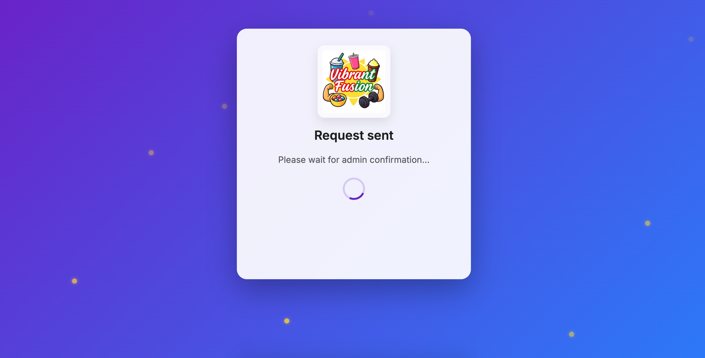
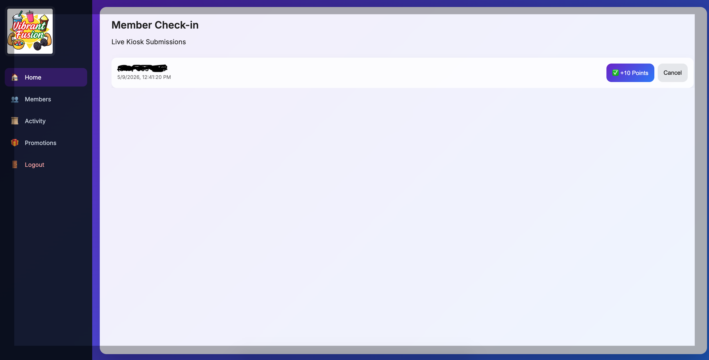
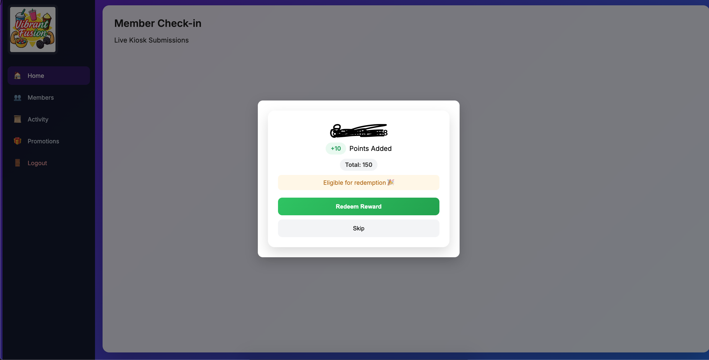

## Overview

The kiosk-to-admin synchronization system was designed as a realtime operational workflow enabling customer-initiated loyalty interactions to propagate immediately into internal administrative tooling.

The subsystem serves as the operational bridge between:

- customer-facing kiosk interactions
- backend transactional workflows
- realtime synchronization infrastructure
- privileged admin operations

The architecture emphasized:

- realtime responsiveness
- operational visibility
- transactional consistency
- workflow isolation
- low-latency synchronization
- scalable event-driven behavior

The synchronization model became one of the platform’s core architectural components.

---

## Architectural Objectives

The kiosk synchronization layer was designed with several primary goals:

- enable realtime operational visibility
- minimize manual refresh workflows
- isolate customer input from privileged actions
- support scalable request processing
- maintain transactional auditability
- simplify operational approval flows

The architecture intentionally separated customer-triggered actions from direct database mutations.

This ensured that all privileged operations remained backend-controlled and operationally auditable.

---

## High-Level Synchronization Flow

```text
Customer Kiosk
       │
       ▼
Phone Number Submission
       │
       ▼
Netlify Function API
       │
       ▼
Pending Request Created
       │
       ▼
Supabase Realtime Event
       │
       ▼
Admin Dashboard Subscription
       │
       ▼
Realtime UI Update
       │
       ▼
Admin Action
(Approve / Reject)
       │
       ▼
Transactional Processing
       │
       ▼
Member Balance Updated
```

---

## Realtime Workflow Diagram


---

## Kiosk Interaction Layer

The kiosk subsystem functions as a lightweight customer interaction surface responsible for:

- customer phone number capture
- visit check-ins
- redemption initiation
- request submission workflows

The kiosk intentionally avoids direct transactional authority.

Responsibilities explicitly excluded from the kiosk layer include:

- direct points mutations
- privileged balance updates
- redemption execution
- operational approvals

This separation significantly improved operational safety and reduced frontend trust requirements.

---

## Kiosk Device Registration & Approval

The kiosk subsystem incorporated a lightweight device registration and approval workflow to control trusted operational devices.

When a kiosk launched for the first time:

1. a device identifier was generated locally
2. the device registered with backend infrastructure
3. the device entered a pending approval state
4. administrative approval was required before activation

This workflow created a controlled onboarding process for operational kiosk devices.

---

## Device Trust Model

Each kiosk device maintains a persistent device identifier used for:

- operational identification
- device approval validation
- trusted request processing
- deployment management

Unapproved devices were restricted from executing operational workflows until explicitly authorized.

This architecture introduced a lightweight trusted-device model without requiring heavyweight infrastructure management.

---

## Operational Benefits

The kiosk approval architecture provided several operational advantages:

- controlled kiosk onboarding
- prevention of unauthorized device usage
- operational visibility into active devices
- simplified multi-kiosk scalability
- device-level trust boundaries

The approval workflow also established a scalable foundation for future multi-location operational deployments.

---

## Customer Submission Workflow

The kiosk submission flow follows a multi-stage backend-controlled process.

### Step 1 — Customer Identification

The customer submits a phone number through the kiosk interface.

Validation includes:

- numeric validation
- length validation
- duplicate prevention checks
- request throttling safeguards

---

### Step 2 — Backend API Submission

The kiosk submits requests to serverless backend endpoints using Netlify Functions.

Backend responsibilities include:

- request validation
- payload sanitization
- operational rule enforcement
- duplicate request prevention
- transactional orchestration

The serverless layer functions as the operational gateway between frontend systems and backend infrastructure.

---

### Step 3 — Pending Request Creation

Validated submissions create entries within the `pending_requests` table.

Each request contains operational metadata including:

- customer phone number
- request type
- request status
- timestamps
- processing state
- optional operational context

The pending request model intentionally functions as an asynchronous operational queue.

This architecture improves:

- workflow traceability
- operational visibility
- synchronization reliability
- future extensibility

---

## Realtime Synchronization Architecture

Realtime synchronization is powered using Supabase realtime subscriptions.

The admin dashboard subscribes to changes on operational tables including:

- pending requests
- request status updates
- transactional changes
- redemption workflows

This architecture enabled:

- near realtime operational visibility
- automatic dashboard updates
- reduced polling complexity
- simplified synchronization infrastructure

The realtime system eliminated the need for:

- manual page refreshes
- custom websocket infrastructure
- dedicated event brokers
- frontend polling loops

---

## Admin Dashboard Synchronization

The admin dashboard operates as a privileged operational control layer.

Primary responsibilities include:

- request approvals
- request rejection
- transactional review
- redemption execution
- operational visibility

When realtime events are received:

1. new requests are rendered immediately
2. operational actions become available
3. request states update dynamically
4. processed requests are removed or updated

This workflow enabled highly responsive operational management without requiring manual synchronization workflows.

---

## Operational Processing Workflow

Administrative actions initiate transactional backend workflows.

### Approval Flow

```text
Admin Approves Request
         │
         ▼
Backend Validation
         │
         ▼
Points Transaction Created
         │
         ▼
Member Balance Updated
         │
         ▼
Request Status Updated
         │
         ▼
Realtime UI Synchronization
```

---

### Rejection Flow

Rejected requests update operational status without mutating loyalty balances.

This preserved auditability while maintaining operational clarity.

---

## Transactional Consistency

The synchronization architecture was intentionally designed around transactional consistency.

Key safeguards included:

- backend-controlled mutations
- approval-gated workflows
- duplicate request prevention
- isolated operational processing
- transactional history logging

This design significantly reduced risks involving:

- duplicate points awards
- race conditions
- conflicting admin actions
- inconsistent frontend state

---

## Race Condition Prevention

Several operational safeguards were implemented to prevent synchronization conflicts.

Examples included:

- disabling repeated admin actions during processing
- backend validation of request state
- idempotent operational workflows
- request status enforcement
- transactional ordering controls

These safeguards improved operational reliability during concurrent admin activity.

---

## Database Architecture

The synchronization subsystem relies heavily on relational operational modeling.

Core entities include:

### Pending Requests

Acts as the operational synchronization bridge between kiosk systems and admin tooling.

---

### Members

Maintains persistent customer loyalty state including balances and visit history.

---

### Transactions

Stores immutable audit records for operational loyalty changes.

---

## UI / UX Synchronization Strategy

Operational responsiveness was prioritized heavily throughout the synchronization experience.

Key UX goals included:

- immediate operational visibility
- minimal admin friction
- reduced manual refresh requirements
- clear request state transitions
- responsive feedback handling

The UI system intentionally emphasized operational efficiency over visual complexity.

---

## Backend Architecture

The synchronization backend leverages:

- Netlify Functions
- Supabase realtime infrastructure
- PostgreSQL transactional modeling
- serverless operational workflows

Backend workflows intentionally isolate:

- validation logic
- transactional execution
- operational authorization
- synchronization processing

This improved maintainability and reduced frontend trust assumptions.

---

## Security Model

Security controls were implemented across multiple operational layers.

Key protections included:

- protected admin workflows
- backend request validation
- restricted transactional execution
- environment variable isolation
- operational authorization boundaries

Sensitive operational actions were intentionally isolated from kiosk clients.

---

## Admin Authentication Architecture

Administrative workflows were protected using Supabase Authentication integrated with backend authorization checks.

The admin platform required authenticated sessions before allowing access to privileged operational workflows including:

- request approvals
- loyalty mutations
- redemption processing
- operational management actions

Authentication responsibilities included:

- session management
- protected admin routing
- authenticated API access
- operational authorization enforcement

Backend serverless functions additionally validated authenticated requests before executing privileged transactional operations.

This architecture ensured that sensitive operational actions remained isolated from unauthenticated frontend access.

---

## Authorization Boundary Design

The system intentionally separated:

- public kiosk workflows
- authenticated admin workflows
- backend transactional execution

This created a layered operational security model where:

- kiosks could submit requests
- admin dashboards could review requests
- only authenticated backend workflows could mutate transactional loyalty state

The authorization boundaries significantly reduced the risk of unauthorized frontend-triggered balance manipulation.

---

## Scalability Considerations

The synchronization architecture was intentionally designed for future scalability.

Potential future expansion areas include:

- multi-location kiosk deployments
- distributed operational dashboards
- event-driven analytics
- customer engagement automation
- asynchronous queue processing
- operational notifications
- distributed promotions workflows

The architecture supports incremental expansion without requiring major synchronization redesign.

---

## Screenshots

### Kiosk Input Experience


---

### Kiosk Request Flow



---

### Admin Dashboard Realtime Updates



---

### Request Approval Workflow



---

## Engineering Scope

This subsystem involved independent ownership across:

- realtime workflow architecture
- kiosk interaction design
- backend orchestration
- transactional synchronization
- operational tooling
- frontend state management
- database modeling
- serverless infrastructure

The resulting system evolved into a production-style realtime operational platform supporting scalable customer engagement workflows and transactional synchronization infrastructure.
