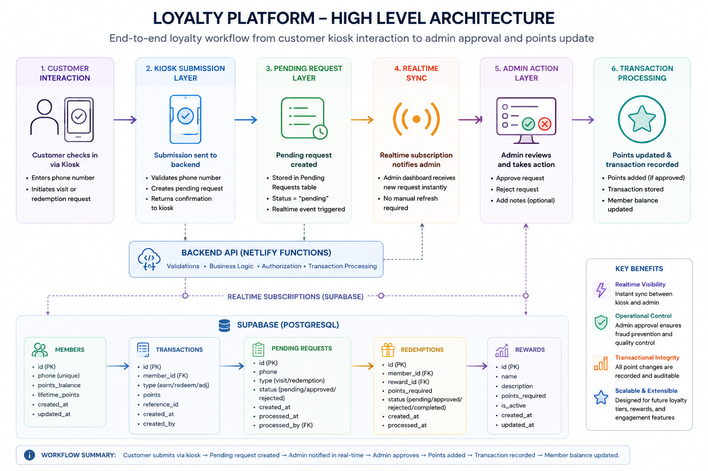

## Overview

The loyalty platform was designed as a modular customer engagement subsystem responsible for rewards tracking, member activity management, redemption workflows, and operational synchronization between customer-facing kiosks and internal admin tooling.

The architecture evolved beyond a traditional point-counter implementation into a transactional workflow system emphasizing:

- operational consistency
- realtime synchronization
- extensible rewards logic
- transactional traceability
- scalable customer engagement workflows

The platform was intentionally designed to support future expansion into promotions, campaign targeting, customer analytics, and engagement automation.

---

## Core Objectives

The loyalty subsystem was designed with several primary goals:

- simplify customer rewards participation
- enable operationally manageable reward workflows
- support realtime kiosk-to-admin synchronization
- provide transactional auditability
- centralize customer engagement data
- support extensible rewards and redemption logic

The architecture intentionally prioritized maintainability and operational simplicity while preserving scalability for future platform growth.

---

## Loyalty Workflow Architecture

The loyalty system operates across four major operational layers:

1. Customer Interaction Layer
2. Kiosk Submission Layer
3. Backend Transaction Layer
4. Admin Operations Layer

The workflows were intentionally separated to isolate customer input, operational decision-making, and transactional processing responsibilities.

---
---

## High-Level Loyalty Architecture

The loyalty platform was designed as a realtime operational workflow system connecting customer kiosks, backend transactional processing, realtime synchronization infrastructure, and admin operational tooling.

The architecture separates customer interaction flows from privileged transactional processing to improve operational control, auditability, and maintainability.



### Architectural Highlights

- Realtime synchronization between kiosks and admin tooling
- Approval-based operational workflows
- Transactional points processing
- Centralized relational data modeling
- Serverless backend orchestration
- Extensible rewards and redemption infrastructure

The loyalty subsystem was intentionally designed around operational traceability and scalable workflow orchestration rather than simplified frontend-only reward calculations.

---
## Customer Interaction Model

Customers interact with the loyalty system primarily through:

- kiosk check-ins
- phone number identification
- rewards eligibility workflows
- redemption requests

The interaction model intentionally minimized customer friction by avoiding account creation requirements during initial engagement workflows.

This simplified onboarding while enabling lightweight member identification and visit tracking.

---

## Member Management System

The loyalty platform maintains centralized member records including:

- phone number identity
- current points balance
- lifetime points accumulation
- visit tracking
- redemption history
- engagement activity

The member model was designed around persistent customer engagement history rather than temporary session-based interactions.

---

## Points Accumulation Workflow

The platform supports operational approval-based point accumulation workflows.

Typical workflow:

```text
Customer Kiosk Check-In
          │
          ▼
Pending Request Created
          │
          ▼
Realtime Admin Notification
          │
          ▼
Admin Approval
          │
          ▼
Points Transaction Processed
          │
          ▼
Member Balance Updated
```

This approval-based architecture provided:

- operational verification
- fraud prevention
- transaction auditability
- controlled loyalty processing

---

## Redemption Workflow Design

The redemption system was designed using configurable reward thresholds rather than hardcoded frontend logic.

The platform supports:

- dynamic reward eligibility
- carry-forward points logic
- redemption approval workflows
- transactional deduction handling
- configurable redemption tiers

The redemption model intentionally separated frontend eligibility presentation from backend transactional processing.

This architecture improved maintainability and reduced business logic duplication across frontend systems.

---

## Transactional Architecture

The loyalty system maintains transactional records for all operational changes.

Transactions include:

- point additions
- reward redemptions
- operational adjustments
- admin actions
- kiosk-triggered workflows

This transactional design enabled:

- auditability
- historical traceability
- operational debugging
- customer activity analysis
- reporting extensibility

The architecture intentionally treated points updates as transactional events rather than direct balance mutations.

---

## Pending Request System

A centralized pending request workflow was introduced to bridge customer kiosks and admin operational tooling.

The request system supports:

- customer check-in requests
- redemption requests
- realtime operational visibility
- approval/rejection workflows
- synchronization state management

This architecture created a clean operational boundary between customer-facing systems and privileged backend actions.

---

## Realtime Synchronization

Realtime synchronization is a foundational component of the loyalty architecture.

The system leverages realtime database subscriptions to synchronize:

- kiosk submissions
- admin dashboard updates
- request approvals
- reward processing
- transaction status changes

This architecture enabled responsive operational workflows without requiring dedicated websocket infrastructure.

Realtime synchronization significantly improved operational responsiveness and reduced manual refresh dependencies.

---

## Database Architecture

The loyalty subsystem leverages relational database modeling to maintain operational consistency.

Core entities include:

### Members

Stores persistent customer loyalty data including:

- phone number identity
- rewards balances
- visit tracking
- engagement history

---

### Transactions

Maintains audit records for all point-related activity including:

- additions
- redemptions
- operational adjustments

---

### Pending Requests

Functions as the operational synchronization layer between kiosks and admin systems.

---

## Operational Tooling

The loyalty platform integrates with internal admin tooling supporting:

- request approvals
- reward processing
- member lookups
- transaction monitoring
- realtime operational visibility

Operational tooling was intentionally designed around simplicity and rapid workflow execution.

---

## Extensibility Strategy

The loyalty architecture was intentionally designed for future extensibility.

Potential expansion areas include:

- tiered loyalty programs
- customer segmentation
- personalized promotions
- analytics dashboards
- automated engagement campaigns
- referral workflows
- multi-location support

The modular architecture enabled incremental feature expansion without requiring major platform rewrites.

---

## Security & Validation

Operational loyalty actions were protected through:

- backend validation
- protected admin workflows
- controlled transactional execution
- restricted operational actions
- server-side processing

Sensitive loyalty updates were intentionally isolated from direct frontend execution.

---

## Engineering Scope

This subsystem involved independent ownership across:

- loyalty workflow architecture
- realtime synchronization design
- transactional modeling
- frontend integration
- backend workflow implementation
- database schema design
- operational tooling integration

The resulting system evolved into a production-style customer engagement platform supporting realtime operational workflows, transactional consistency, and extensible loyalty infrastructure.
