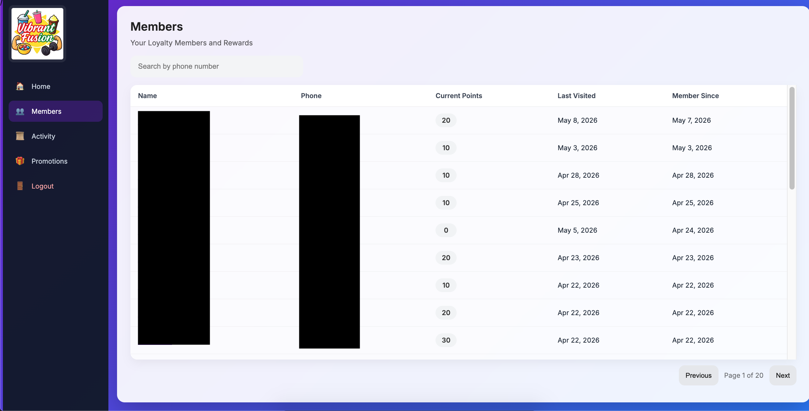
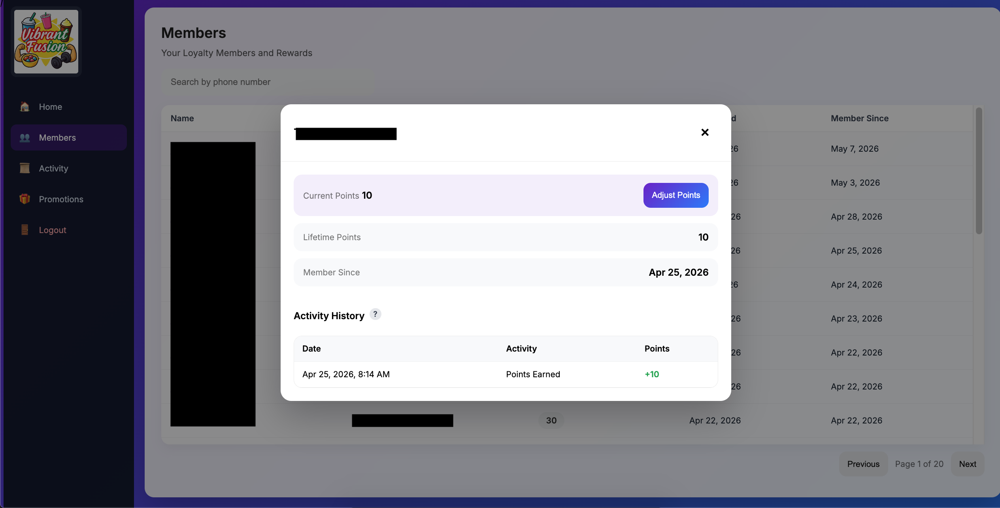
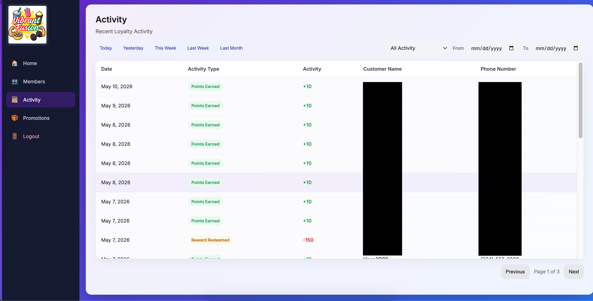

## Overview

The members and transactions subsystem was designed as the centralized operational data layer for the loyalty platform.

The architecture maintains persistent customer engagement state, transactional history, loyalty balances, and operational auditability across all customer interaction workflows.

The subsystem was intentionally designed around relational transactional modeling rather than simplified balance-only storage.

This approach improved:

- operational traceability
- historical auditability
- loyalty workflow extensibility
- realtime synchronization compatibility
- reporting and analytics potential

The resulting architecture became a foundational component supporting loyalty workflows, kiosk interactions, redemption processing, promotions targeting, and operational tooling.

---

## Architectural Objectives

The subsystem was designed with several primary goals:

- maintain persistent customer loyalty state
- support transactional auditability
- centralize customer engagement history
- simplify operational tooling integration
- support realtime synchronization workflows
- preserve extensibility for future platform growth

The data architecture intentionally separated:

- persistent member state
- operational request workflows
- immutable transactional records

This separation significantly improved maintainability and operational clarity.

---

## High-Level Data Architecture

```text
Customer Interaction
         │
         ▼
Pending Request Workflow
         │
         ▼
Operational Approval
         │
         ▼
Transaction Created
         │
         ▼
Member Balance Updated
         │
         ▼
Realtime Synchronization
         │
         ▼
Admin Dashboard + Customer Flows
```

---

## Members Architecture

The members table functions as the persistent customer identity and loyalty state layer.

Each member record maintains:

- customer phone number
- current loyalty balance
- lifetime points accumulation
- visit tracking
- engagement metadata
- operational timestamps
- account status information

The architecture intentionally uses phone-number-based identity to reduce onboarding friction and simplify customer participation workflows.

---

## Member Lifecycle

Typical member lifecycle flow:

```text
First Customer Check-In
         │
         ▼
Member Record Created
         │
         ▼
Visits & Transactions Accumulate
         │
         ▼
Rewards Eligibility Updated
         │
         ▼
Redemption Activity Processed
         │
         ▼
Long-Term Engagement History Maintained
```

This lifecycle model enabled persistent customer engagement tracking without requiring heavyweight account management systems.

---

## Member State Management

The subsystem maintains both:

- current operational state
- historical transactional state

Examples include:

### Current State

- current points balance
- active/inactive status
- last visit timestamp
- total visit count

---

### Historical State

- lifetime points earned
- redemption history
- transactional activity
- operational adjustments

This dual-state model improved operational visibility while preserving long-term auditability.

---

## Transactions Architecture

The transactions table functions as the immutable operational ledger of loyalty activity.

Rather than directly mutating balances without history, all loyalty changes generate transactional records.

Transaction types include:

- points additions
- reward redemptions
- operational adjustments
- admin-triggered updates
- kiosk-originated workflows

This architecture provides strong operational traceability and simplifies debugging, reporting, and future analytics expansion.

---

## Transaction Workflow

Typical transactional flow:

```text
Operational Action
         │
         ▼
Backend Validation
         │
         ▼
Transaction Record Created
         │
         ▼
Member Balance Updated
         │
         ▼
Realtime Synchronization
         │
         ▼
Operational Visibility Updated
```

The workflow intentionally treats transactions as the authoritative operational history layer.

---

## Transactional Consistency

The subsystem was designed with transactional consistency as a primary architectural concern.

Key safeguards included:

- backend-controlled mutations
- approval-gated operational flows
- immutable transaction records
- synchronized balance updates
- request state validation
- transactional ordering protections

This architecture significantly reduced risks involving:

- duplicate balance mutations
- inconsistent operational state
- race conditions
- conflicting admin actions

---

## Pending Requests Integration

The members and transactions subsystem integrates closely with the pending request workflow architecture.

Pending requests function as the operational bridge between:

- customer kiosk actions
- admin approvals
- transactional processing
- member state updates

This asynchronous processing model improved:

- operational control
- request traceability
- synchronization reliability
- workflow extensibility

---

## Realtime Synchronization

Realtime subscriptions synchronize operational data changes across:

- admin dashboards
- kiosk workflows
- request states
- loyalty balances
- transactional updates

This architecture enabled:

- immediate operational visibility
- responsive admin tooling
- reduced manual refresh dependencies
- simplified synchronization workflows

Realtime synchronization significantly improved operational responsiveness across the platform.

---

## Database Modeling Strategy

The relational schema design emphasized:

- normalized operational structures
- transactional traceability
- auditability
- workflow clarity
- extensibility

Core operational entities include:

### Members

Persistent customer engagement state.

---

### Transactions

Immutable operational ledger.

---

### Pending Requests

Operational synchronization workflow layer.

---

### Promotions & Recipients

Customer engagement targeting infrastructure.

---

## Operational Tooling Integration

The subsystem integrates directly with admin operational tooling supporting:

- member search workflows
- loyalty balance visibility
- transaction review
- operational approvals
- realtime request management
- redemption processing

The operational tooling architecture intentionally prioritized workflow efficiency and operational clarity.

---

## Scalability & Extensibility

The subsystem was intentionally designed to support future expansion areas including:

- customer segmentation
- analytics dashboards
- rewards tiering
- engagement scoring
- promotional targeting
- multi-location support
- customer lifecycle analysis

The modular relational architecture supports incremental expansion without requiring major schema redesign.

---

## Security & Data Protection

Sensitive operational workflows were protected using:

- backend-controlled mutations
- authenticated admin access
- server-side validation
- restricted operational actions
- transactional authorization checks

Frontend systems were intentionally prevented from directly mutating critical loyalty state.

---

## Screenshots

### Members Management Dashboard



---

### Member Activity Drilldown



---

### Transactions History View



---

### Redemption Processing Workflow


---

## Engineering Scope

This subsystem involved independent ownership across:

- relational database modeling
- transactional workflow design
- loyalty state management
- realtime synchronization
- backend operational processing
- admin tooling integration
- frontend operational visibility
- customer engagement architecture

The resulting system evolved into a production-style operational data platform supporting realtime loyalty workflows, transactional traceability, and scalable customer engagement infrastructure.
