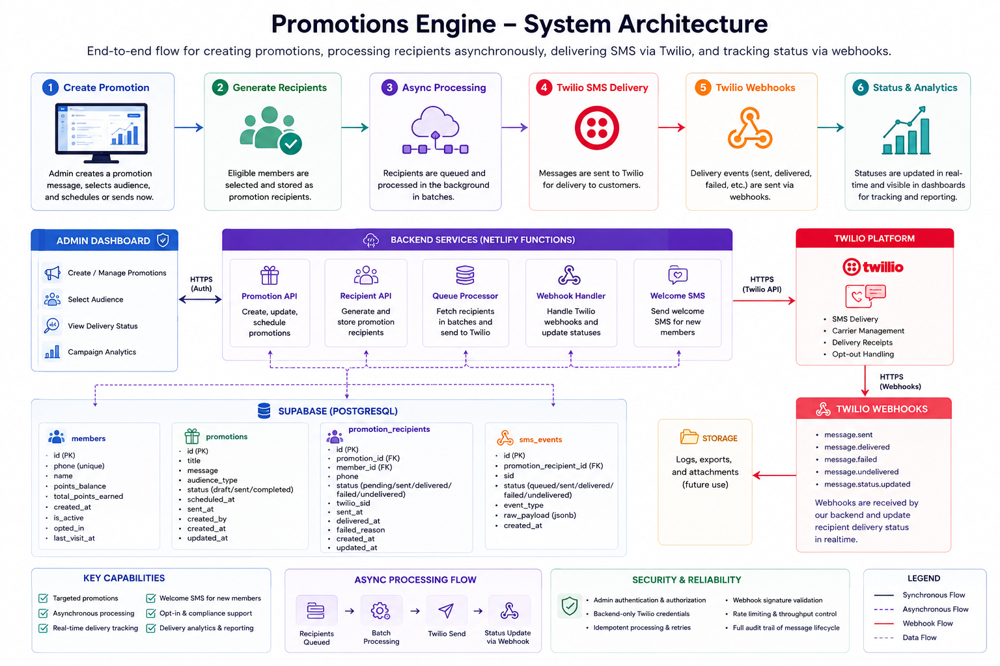
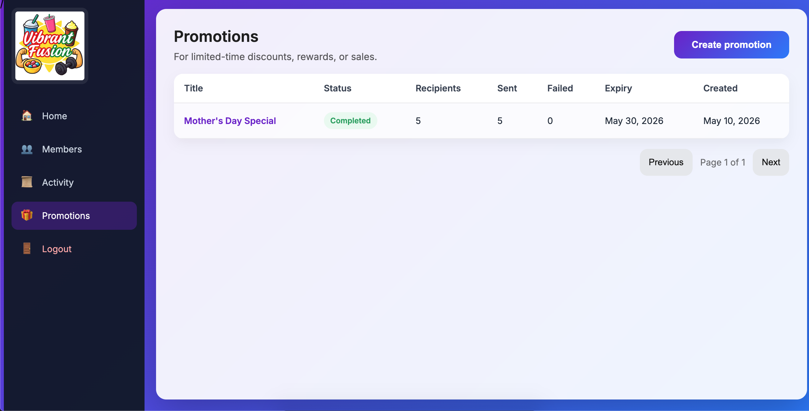
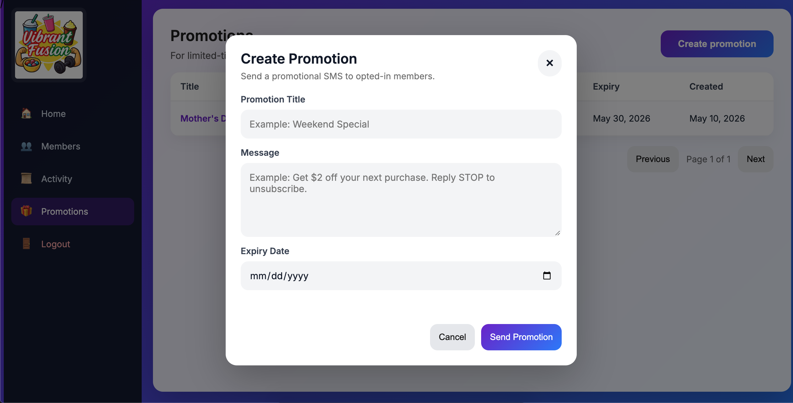
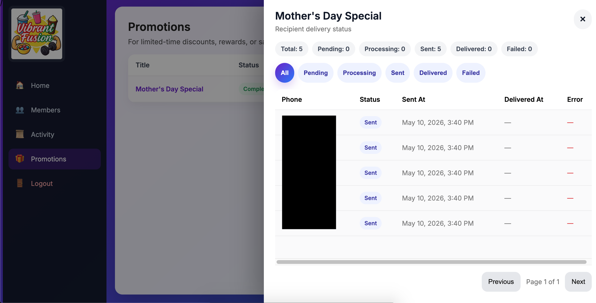

## Overview

The promotions engine was designed as a scalable customer engagement subsystem responsible for SMS campaign delivery, customer targeting workflows, asynchronous message processing, and engagement lifecycle communication.

The subsystem evolved beyond simple bulk messaging into a structured operational workflow integrating:

- customer segmentation
- campaign management
- asynchronous processing
- delivery tracking
- Twilio messaging infrastructure
- transactional customer notifications
- opt-in compliance workflows

The architecture emphasized:

- operational scalability
- asynchronous processing reliability
- messaging traceability
- extensible campaign workflows
- controlled delivery orchestration

The resulting system became a foundational customer engagement layer integrated directly with the loyalty platform.

---

## Architectural Objectives

The promotions subsystem was designed with several primary goals:

- enable scalable customer engagement workflows
- support asynchronous campaign processing
- centralize promotions tracking
- integrate transactional messaging
- support opt-in compliant SMS delivery
- preserve operational visibility and auditability

The architecture intentionally separated:

- campaign definitions
- recipient targeting
- delivery execution
- webhook processing
- customer engagement state

This separation significantly improved maintainability and future extensibility.

---

## High-Level Promotions Architecture

```text
Admin Dashboard
        │
        ▼
Promotion Created
        │
        ▼
Recipients Selected
        │
        ▼
Promotion Recipients Generated
        │
        ▼
Async Processing Function
        │
        ▼
Twilio SMS Delivery
        │
        ▼
Twilio Webhooks
        │
        ▼
Delivery Status Updates
        │
        ▼
Operational Visibility
```

---
---

## Promotions Engine Diagram

The promotions subsystem combines asynchronous backend processing, relational campaign modeling, Twilio SMS infrastructure, realtime delivery tracking, and webhook-driven operational visibility.

The architecture was intentionally designed to support scalable customer engagement workflows while maintaining delivery traceability and operational auditability.



### Key Architectural Areas

- Async campaign processing workflows
- Relational promotions and recipient modeling
- Twilio SMS delivery integration
- Delivery lifecycle webhook handling
- Welcome SMS onboarding automation
- Realtime operational visibility
- Backend-only secure messaging orchestration

The subsystem intentionally separates campaign creation, recipient generation, delivery execution, and webhook processing into isolated operational workflows to improve maintainability and scalability.

---


## Promotions Workflow Diagram


---

## Promotions Data Architecture

The subsystem leverages relational operational modeling to manage campaigns and recipient delivery workflows.

Core entities include:

### Promotions

Stores campaign-level metadata including:

- campaign title
- campaign message
- delivery status
- scheduling information
- operational timestamps
- campaign lifecycle state

The promotions table functions as the authoritative campaign management layer.

---

### Promotion Recipients

Stores delivery-level records for individual customer recipients.

Each record includes:

- linked promotion identifier
- member reference
- phone number
- delivery status
- send timestamps
- Twilio delivery metadata
- processing state
- webhook response data

This architecture enables detailed delivery traceability and operational visibility at the recipient level.

---

## Campaign Processing Workflow

Campaign execution follows an asynchronous processing architecture.

Typical workflow:

```text
Promotion Created
        │
        ▼
Recipient Population Generated
        │
        ▼
Queued Async Processing
        │
        ▼
Twilio SMS Requests
        │
        ▼
Delivery Tracking
        │
        ▼
Webhook Status Updates
        │
        ▼
Operational Dashboard Visibility
```

This design intentionally avoids synchronous bulk processing directly from the admin interface.

---

## Asynchronous Processing Architecture

Promotional delivery processing was intentionally designed as an asynchronous workflow.

This architecture provides several operational advantages:

- reduced admin UI blocking
- improved delivery scalability
- controlled outbound message throughput
- simplified retry handling
- operational fault isolation

Backend processing functions iterate through recipient records independently while maintaining campaign-level operational visibility.

This design supports future scalability improvements such as:

- queue-based processing
- scheduled campaigns
- batch throttling
- retry pipelines
- distributed delivery orchestration

---

## Twilio Integration

The promotions subsystem integrates with Twilio for SMS delivery infrastructure.

Twilio responsibilities include:

- outbound SMS delivery
- delivery status tracking
- carrier handling
- messaging compliance infrastructure
- webhook event delivery

The integration architecture leverages secure backend-only communication between serverless functions and Twilio APIs.

Sensitive Twilio credentials are isolated using environment-based configuration.

---

## SMS Delivery Workflow

Outbound delivery flow:

```text
Promotion Recipient
        │
        ▼
Backend Processing Function
        │
        ▼
Twilio API Request
        │
        ▼
Carrier Delivery
        │
        ▼
Twilio Status Webhook
        │
        ▼
Recipient Status Updated
```

This workflow maintains operational visibility throughout the full delivery lifecycle.

---

## New Member Welcome SMS

The subsystem also supports transactional onboarding workflows including automated welcome messaging for new loyalty members.

Typical onboarding flow:

```text
New Member Registration
        │
        ▼
Backend Event Trigger
        │
        ▼
Welcome SMS Function
        │
        ▼
Twilio Delivery
        │
        ▼
Customer Confirmation Message
```

Welcome messaging workflows improve:

- customer onboarding engagement
- loyalty awareness
- participation activation
- customer communication consistency

This architecture establishes a foundation for future lifecycle engagement automation.

---

## Twilio Webhooks

The subsystem integrates Twilio webhook processing to track delivery lifecycle events.

Webhook events include:

- message delivered
- message failed
- carrier rejection
- undelivered status
- delivery confirmation

Webhook processing updates recipient delivery state in realtime.

This architecture enables:

- delivery monitoring
- operational troubleshooting
- campaign analytics
- delivery auditability
- retry workflow support

The webhook model significantly improves operational visibility compared to fire-and-forget delivery approaches.

---

## Opt-In & Compliance Design

The promotions architecture was designed with opt-in workflow support and messaging compliance considerations.

Operational support areas include:

- customer opt-in tracking
- promotional consent workflows
- unsubscribe handling
- messaging disclosures
- delivery transparency

The architecture supports future extensibility for:

- A2P compliance workflows
- campaign categorization
- messaging preferences
- opt-out automation
- compliance audit tracking

---

## Operational Tooling Integration

The promotions subsystem integrates directly with admin operational tooling supporting:

- campaign creation
- promotions visibility
- recipient management
- delivery monitoring
- campaign lifecycle tracking
- realtime processing visibility

Operational tooling was intentionally designed for simplified campaign management and operational transparency.

---

## Realtime Operational Visibility

Realtime synchronization workflows support operational monitoring across:

- campaign processing state
- recipient delivery status
- async processing progress
- webhook updates
- campaign completion tracking

This architecture enables responsive operational visibility without requiring manual refresh workflows.

---

## Scalability Considerations

The promotions engine was intentionally designed for future scalability.

Potential expansion areas include:

- scheduled campaigns
- audience segmentation
- customer targeting rules
- delivery analytics
- engagement scoring
- retry orchestration
- multi-channel messaging
- campaign automation pipelines

The architecture supports incremental expansion without requiring major subsystem redesign.

---

## Security Model

Sensitive messaging workflows were protected using:

- backend-only Twilio access
- environment variable isolation
- authenticated admin actions
- protected campaign management
- server-side delivery orchestration

Twilio credentials and operational delivery workflows were intentionally isolated from frontend systems.

---

## Screenshots

### Promotions Dashboard



---

### Campaign Creation Workflow



---

### Recipient Processing View



---

## Engineering Scope

This subsystem involved independent ownership across:

- asynchronous workflow architecture
- Twilio integration
- relational database modeling
- campaign processing design
- webhook handling
- customer engagement workflows
- backend orchestration
- operational tooling integration

The resulting system evolved into a production-style customer engagement platform supporting scalable messaging workflows, realtime operational visibility, asynchronous campaign processing, and extensible SMS infrastructure.
