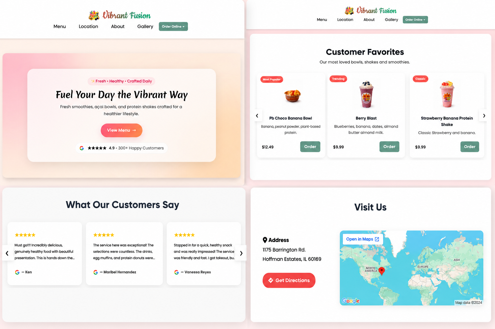
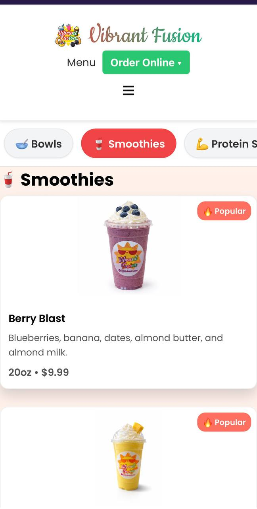
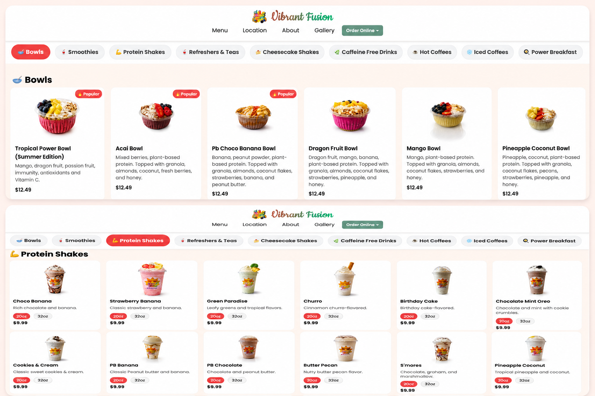

# Website Platform

## Overview

The Vibrant Fusion website was designed and developed as a modern customer-facing digital platform for a retail smoothie and bowls business.

The project evolved beyond a traditional informational website into a broader engagement platform that later integrated loyalty workflows, kiosk-based customer interactions, promotions infrastructure, and operational tooling.

This platform was independently architected and implemented end-to-end during an independent engineering phase focused on full-stack product development, cloud architecture, and customer engagement systems.

---

# Product Goals

The website platform was designed with the following objectives:

- Establish a modern digital presence
- Improve mobile customer engagement
- Support responsive cross-device usability
- Create a scalable frontend foundation
- Centralize business information and branding
- Enable future expansion into loyalty and customer engagement tooling

The frontend architecture intentionally prioritized simplicity, maintainability, and extensibility over framework-heavy implementation patterns.

---

# Frontend Architecture

The platform followed a lightweight frontend architecture centered around responsive rendering, modular page organization, and reusable UI structures.

The frontend system was organized into multiple business-facing sections including:

- Home
- Menu
- About
- FAQ
- Contact
- Location Information

This modular separation enabled cleaner content management, reusable styling patterns, and consistent navigation behavior across the platform.

The architecture emphasized:

- minimal frontend overhead
- fast-loading static assets
- simplified deployment workflows
- responsive layout scalability
- maintainable UI organization

---

# Responsive Design System

The frontend experience was designed mobile-first with adaptive layouts optimized for:

- smartphones
- tablets
- desktop browsers

Key implementation areas included:

- responsive navigation systems
- adaptive typography scaling
- touch-friendly interactions
- image responsiveness
- flexible layout containers
- visual consistency across devices

The UI layer focused heavily on usability and customer readability while maintaining lightweight rendering behavior.

---

# UI / UX Engineering

The frontend experience emphasized operational simplicity and customer accessibility.

Areas of focus included:

- streamlined customer navigation
- optimized product discoverability
- simplified interaction flows
- responsive visual hierarchy
- branding consistency
- readability across varying screen sizes

The design system intentionally avoided unnecessary frontend complexity while preserving extensibility for future platform integrations.

---

# Platform Expansion Strategy

The website was architected as the public-facing layer of a larger customer engagement ecosystem.

The platform later expanded into:

- loyalty infrastructure
- kiosk-based workflows
- real-time admin tooling
- rewards tracking systems
- SMS promotions infrastructure
- customer activity monitoring
- transactional history systems

This phased architecture approach enabled the platform to evolve incrementally without requiring major frontend rewrites or operational restructuring.

---

# Deployment Architecture

The platform leveraged modern cloud deployment patterns including:

- static frontend hosting
- serverless backend integration
- managed backend services
- environment-based configuration
- cloud-hosted deployment workflows

The architecture prioritized:

- low operational overhead
- simplified deployment management
- maintainable infrastructure
- rapid iteration capability
- scalable service integration

---

# Screenshots

## Homepage

---

## Mobile Experience

---

## Menu Experience

---

# Outcomes

The platform served as both:

- a production business system
- an applied engineering initiative focused on scalable customer engagement architecture

The project involved independent ownership across:

- frontend engineering
- backend integration
- cloud deployment
- architecture design
- UI / UX implementation
- operational tooling expansion
- customer engagement workflows

The system ultimately became the foundation for a broader loyalty and operational platform integrating frontend experiences, realtime workflows, and backend service orchestration.
